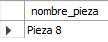

# EXAMEN SIMULACRO 3 BASES DE DATOS

_Query 1:_

SELECT nombre_pieza
FROM piezas
WHERE color="rojo";

_Query 2:_

SELECT nombre_proveedor
FROM proveedores
WHERE ciudad_proveedor="Madrid";

_Query 3:_

SELECT nombre_pieza
FROM piezas
WHERE peso IN (
SELECT max(peso)
FROM piezas);

_Query 4:_

SELECT DISTINCT nombre_proveedor
FROM (proveedores
INNER JOIN piezas on proveedores.id_proveedor=piezas.id_proveedor)
WHERE (SELECT count(id_pieza)
FROM (piezas
INNER JOIN proveedores on piezas.id_proveedor=proveedores.id_proveedor)
GROUP BY proveedores.id_proveedor
ORDER BY count(id_pieza) DESC LIMIT 1);

_Query 5:_

SELECT nombre_proveedor
FROM (piezas
INNER JOIN proveedores on piezas.id_proveedor=proveedores.id_proveedor)
WHERE piezas.color="azul"
GROUP BY proveedores.id_proveedor
ORDER BY count(id_pieza) DESC LIMIT 1;

_Query 6:_

SELECT nombre_pieza
FROM (piezas
INNER JOIN proveedores on piezas.id_proveedor=proveedores.id_proveedor)
WHERE proveedores.nombre_proveedor="Proveedor A" AND piezas.peso IN (
SELECT min(peso)
FROM (piezas
INNER JOIN proveedores on piezas.id_proveedor=proveedores.id_proveedor)
GROUP BY proveedores.id_proveedor)

_Query 7:_

SELECT nombre_proveedor
FROM (proveedores
INNER JOIN piezas on proveedores.id_proveedor=piezas.id_proveedor)
ORDER BY piezas.peso DESC LIMIT 1;

_Query 8:_

SELECT nombre_pieza
FROM (piezas
INNER JOIN proveedores on piezas.id_proveedor=proveedores.id_proveedor)
WHERE proveedores.ciudad_proveedor="Barcelona";

_Query 9:_

SELECT nombre_proveedor
FROM (proveedores
INNER JOIN piezas on proveedores.id_proveedor=piezas.id_proveedor)
WHERE piezas.color="verde"
GROUP BY proveedores.id_proveedor
ORDER BY count(id_pieza) DESC
LIMIT 1;

_Query 10:_

SELECT nombre_pieza
FROM (piezas
INNER JOIN proveedores on piezas.id_proveedor=proveedores.id_proveedor)
WHERE proveedores.ciudad_proveedor="Valencia"
ORDER BY piezas.peso DESC
LIMIT 1;

